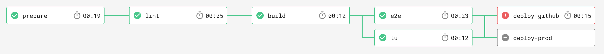

# create-react-app + circleci workflows 

Build, test and deploy your ReactJS application to GitHub pages

Continuous integration/deployment workflows with CircleCI

Environnements variables to configure on circleci :

 - `GH_USER` : will push on the gh-pages branch
 - `GH_EMAIL` : your github email address